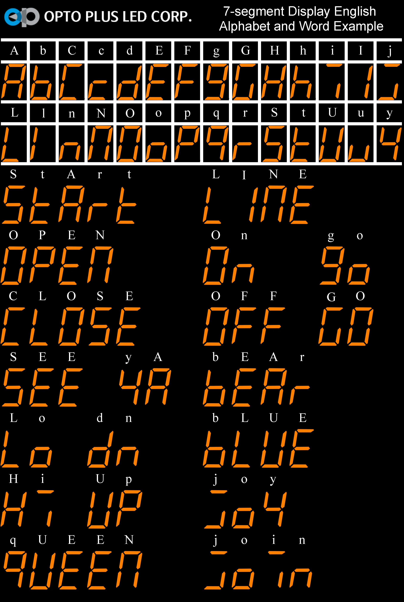

# Assembly notes

Vref pin on Arduino Pro Mini breakout board is not on any pin, solder a wire to capacitor between 
pins 12 and 13. To the pin13 end.

Manufactured PCBs have a defect, bridge these tracks
see manufactured-pcb-defect.png

# 7 Segments text

Here is an example of which letters are possible

A,b,C,c,d,E,F,g,G,H,h,i,I,j,L,l,n,N,O,o,P,q,r,S,t,U,u,y

# Notes

* The final PCB layout that I ordered from https://jlcpcb.com/ is not great. This is my almost first attempt to really use two sides with a lot of vias. Maybe next time use the lower side for horizontal signal traces and the top side for vertical? 

* Maybe replace 2.5V ref to MCU with feeding the whole MCU from 2.5V ref, it eliminates the extra wire.

* Next time make use wider ribbon cable - use more LEDs on the front panel to indicate the current mode and state

* Update the firmware to include trickle charge, it's especially noticeable when charging to the 3.8V for storage, once 
charging power is removed - voltage drops.